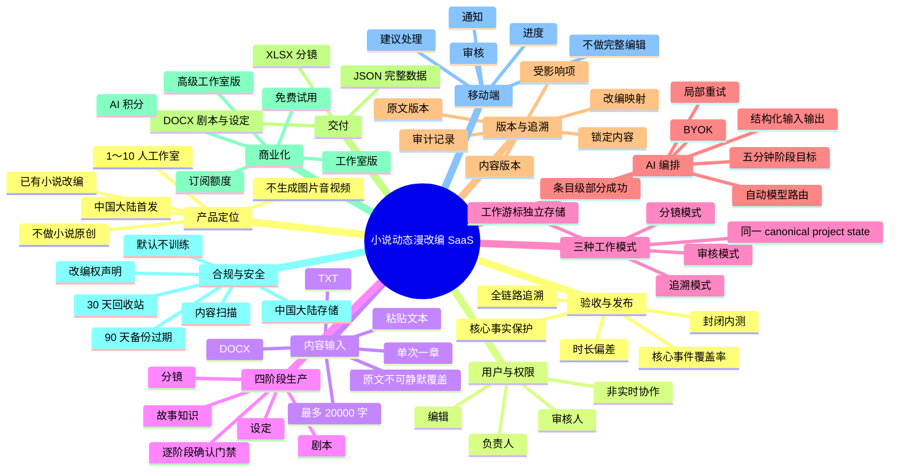

# AI 小说动态漫改编工作台：需求思维导图

状态：T03 架构设计输入  
日期：2026-09-22  
依据：`REQUIREMENTS.md`、`PRODUCT_SPEC.md`、领域契约、行业研究和内部探索测试

## 1. 总览



## 2. 产品定位与范围

### 2.1 要解决的问题

- 将已有小说章节转成动态漫生产可以继续使用的结构化资料。
- 减少人工从原文提取人物、场景、道具、事件和世界规则的重复工作。
- 避免 AI 为追求影视节奏静默改变核心事实。
- 保留原文、剧本、设定和分镜之间的证据链。
- 支持工作室逐阶段审核，而不是一次生成后只能整体接受或重做。

### 2.2 MVP 包含

- 项目、章节、成员和权限。
- 原文导入、章节识别和版本保存。
- 故事知识提取与确认。
- 拆集建议和动态漫结构化剧本。
- 角色、场景、道具和全局画风文字设定。
- 逐镜结构化分镜。
- 版本、影响分析、修改建议、锁定和审计。
- DOCX、XLSX、JSON 导出。
- 订阅、积分、后台任务、通知和 BYOK。

### 2.3 MVP 明确不包含

- AI 小说原创、续写、发布与连载。
- 图片、音频、视频生成及 4K 成片。
- 自动粗剪和专业剪辑时间线。
- 多人实时共同编辑。
- 整本小说一次性自动处理。
- 自建基础模型或 GPU 集群。

## 3. 用户、组织与权限

### 3.1 用户角色

- **负责人**：创建项目、管理成员、删除项目、处理建议、确认阶段、锁定与导出。
- **编辑**：编辑候选内容；对已确认内容只能提交修改建议。
- **审核人**：处理建议、确认阶段、锁定内容、查看审计。

### 3.2 协作原则

- MVP 不支持同时编辑同一内容。
- 正式内容只能通过新版本或接受修改建议发生变化。
- 建议必须包含替换内容、理由、作者、状态和处理结果。
- 所有重要动作记录操作者、时间和目标版本。

### 3.3 登录与账号

- 中国大陆手机号验证码登录。
- 微信扫码登录。
- 手机号与微信可以绑定同一账号。
- 重复账号合并规则仍需在实现前细化。

## 4. 项目、原文与章节

### 4.1 项目模型

- 一个项目代表一部作品。
- 项目可以保存多个章节，但 MVP 每次只处理一章。
- 项目创建时选择 9:16 或 16:9、默认旁白型或对白型。

### 4.2 导入

- 支持粘贴文本、TXT、DOCX。
- 多章节文件先识别目录，再让用户选择本次章节。
- 其余章节保存在项目中等待后续处理。
- 单章最多约 20,000 个中文字符；超出时要求拆分，不静默截断。
- 上传前确认拥有作品或合法改编权。

### 4.3 原文权威性

- 原文是改编事实的最终证据。
- 原文版本不可静默覆盖。
- 每个原文片段拥有稳定 ID、顺序、位置和内容哈希。
- 重新上传创建新原文版本并显示差异。
- 变更只标记下游受影响项，不自动覆盖下游内容。

## 5. 四阶段生产流程

### 5.1 故事知识

- 提取人物、关系、事件、场景、道具和世界规则。
- 区分原文明示、AI 推断和用户批准的改编新增。
- 人物别名与隐藏身份不确定时保留候选关系及双方证据。
- 冲突事实并列保存，由用户分类为设定变化、人物误解、作者矛盾或其他。
- 用户可以编辑、接受、拒绝、锁定和局部重试。

### 5.2 拆集与剧本

- 单集目标时长预设为 1、3、5 分钟。
- AI 根据剧情密度建议一章拆成一集或多集。
- 每集展示覆盖的原文范围和核心事件。
- 默认允许压缩描述和合并场次，但不得改变核心事实。
- 合并人物、删除重要事件、重排事件属于重大改编，必须逐项批准。
- 剧本字段：场次标题、环境、人物、动作、对白、旁白和声音。
- 环境与心理描写转换为环境镜头、动作、声音或旁白，并记录转换方式。

### 5.3 设定

- 角色卡：年龄、体型、发型、服装、标志物、性格外显、表情习惯、动作习惯、当前状态、状态变化、禁止表现。
- 场景卡：空间结构、时代、天气、光线和色调。
- 道具卡：外观、材质、尺寸、持有人和剧情作用。
- 全局画风使用预设并允许编辑文字定义。
- 设定资产拥有稳定 ID，可被多个镜头引用和锁定。

### 5.4 分镜

- 按视觉焦点、动作、情绪和信息变化拆镜，不按固定秒数机械切分。
- 镜头字段：画面、人物、动作、对白/旁白、时长、景别、机位、运镜、声音、情绪、资产引用。
- 每镜关联剧本元素和原文证据，并记录拆分依据。
- 镜头总时长与目标时长偏差不得超过 10%。
- 支持单镜编辑、建议、锁定和局部重生成。

### 5.5 阶段门禁

```text
故事知识已确认 → 才能生成正式剧本
剧本已确认     → 才能生成正式设定
设定已确认     → 才能生成正式分镜
分镜已确认     → 才能作为正式交付内容
```

用户可以查看所有工作模式，但模式切换不得绕过上述门禁。

## 6. 三种工作模式

### 6.1 追溯模式

- 左侧原文、中间改编内容、右侧证据与审核检查器。
- 点击任一改编内容高亮来源；点击原文显示相关改编内容。
- 显示转换类型：保留、压缩、合并、动作化、视觉化或改编新增。

### 6.2 审核模式

- 阶段导航、原文对照、候选内容、修改建议和确认门禁。
- 重点处理不确定项、重大改编、建议和阶段确认。
- 已处理建议不能继续显示为待处理。

### 6.3 分镜模式

- 镜头列表、当前镜头详情、原文依据和资产引用。
- 支持逐镜检查和全局时长检查。
- 设定未确认时只能显示空状态或明确的只读示例，不能伪装成正式分镜。

### 6.4 共享状态

- 三种模式只是一份 canonical project state 的不同投影。
- `workMode` 和当前工作游标属于用户工作状态，不进入内容版本。
- 工作游标包含项目、章节、集、场次、剧本元素、镜头和原文片段定位。
- 切换模式不得复制内容、创建版本、触发 AI 或丢失建议/确认状态。

## 7. AI 编排与模型边界

### 7.1 任务类型

- 原文解析与故事知识提取。
- 拆集建议。
- 剧本生成。
- 设定生成。
- 分镜生成。
- 局部重新生成和失败项重试。

### 7.2 任务状态

- 排队、运行中、部分成功、失败、受限、等待用户、完成、取消。
- 关闭页面后任务继续运行。
- 页面显示阶段进度、成功范围、失败范围和原因。
- 完成或需要处理时发送站内通知。

### 7.3 模型适配

- 领域对象不得包含供应商专有负载。
- 平台根据任务自动选择模型。
- 适配层负责供应商限制、批量拆分、参数转换、重试和成本记录。
- 高级版允许 BYOK；密钥按租户加密存储且禁止进入日志。

### 7.4 可靠性

- AI 输出先通过 JSON Schema，再执行跨对象业务校验。
- 条目级部分成功，成功内容保留。
- `jobId + scopeKey` 保证回调和重试幂等。
- 重试不得覆盖未选范围、已确认或锁定内容。
- 不超过 20,000 字的一章，每个 AI 阶段通常在 5 分钟内返回。

## 8. 版本、追溯与影响分析

- 原文版本和内容版本不可变；编辑产生新候选版本。
- AI 输出默认是候选内容，确认后才能成为下游依据。
- 锁定内容不能被批量生成或重生成覆盖。
- 每个正式项目条目都需要原文证据或已批准的改编新增。
- 上游变更产生受影响项列表，由用户选择保留、修订或重生成。
- 关键操作进入审计：导入、建议、确认、锁定、重生成、导出、删除。

## 9. 导出与下游交付

- **DOCX**：项目说明、拆集大纲、已确认剧本、角色/场景/道具设定和全局画风。
- **XLSX**：每集一个分镜工作表，包含镜头字段、资产引用和追溯标识。
- **JSON**：全部结构化数据、Schema 版本、内容版本、确认状态和追溯关系。
- 普通编辑和导出不消耗 AI 积分。
- 默认只导出已确认内容；候选导出必须醒目标记。

## 10. 订阅、积分与成本

- 套餐：免费试用、工作室版、高级工作室版（BYOK）。
- 免费试用最多处理 3,000 字，输出能力受额度限制。
- 付费套餐限制成员数量和每月 AI 积分。
- AI 任务提交前显示预计积分并冻结额度。
- 按成功完成部分结算，失败部分自动退回。
- BYOK 调用不消耗对应模型积分，但仍受订阅、合规和审计约束。

## 11. 合规、安全与数据生命周期

- 中国大陆用户作品默认存储在中国大陆区域。
- 用户内容默认不用于平台或第三方模型训练。
- 数据可能离境前明确说明范围并取得必要授权。
- 上传内容执行自动合规扫描；受限任务说明原因并提供申诉。
- 有效版权投诉期间暂停生成和分享，等待授权证明。
- 删除项目后进入 30 天回收站；到期删除业务数据和对象文件。
- 备份最长 90 天自然过期。
- AI 生成属性、模型提供商和内容 ID 随内容进入审计与导出元数据。

## 12. 移动端范围

- 查看任务进度和结果摘要。
- 审核阶段结果。
- 接受或拒绝修改建议。
- 接收站内通知。
- 不支持完整剧本、设定和分镜编辑。

## 13. 质量、测试与发布

### 13.1 内容质量

- 核心事件覆盖率不低于 90%。
- 不得虚构或改变未经批准的核心事实。
- 对白、动作、设定和镜头均可追溯或标记改编新增。
- 分镜总时长偏差不超过 10%。

### 13.2 测试层级

- Schema 合法/非法夹具。
- 跨对象领域不变量和状态机测试。
- 权限、门禁、版本、幂等和积分结算测试。
- AI Provider 契约测试，不依赖付费模型。
- 三模式工作游标与投影一致性测试。
- 端到端纵向流程测试。

### 13.3 发布验证

- T01a：公开资料研究与内部探索测试，已完成。
- T02：统一领域和数据契约，已完成。
- T03：架构与技术栈决策，当前阶段。
- T01b：可操作 MVP 后邀请 5～10 家工作室进行真实验证。
- 产品成功信号：至少 5 家完成流程，至少 3 家在 14 天内处理第二个项目或章节并表达付费意愿。

## 14. 架构设计必须继承的约束

1. 采用模块化单体优先，不为假设规模提前引入微服务。
2. 同步 API 与异步 AI Worker 分离扩缩容，但共享明确的领域契约。
3. PostgreSQL 保存权威关系和事务；对象存储保存原文件与导出物。
4. 模型供应商通过适配器接入，不进入 canonical domain model。
5. 工作模式与阶段正交，UI 工作游标独立于内容版本。
6. 每个写操作都必须经过租户、权限、版本和锁定校验。
7. AI 任务、积分冻结与结算必须幂等且可审计。
8. 所有未经过真实用户验证的 UI 结构保持可替换，不进入不可逆领域边界。

