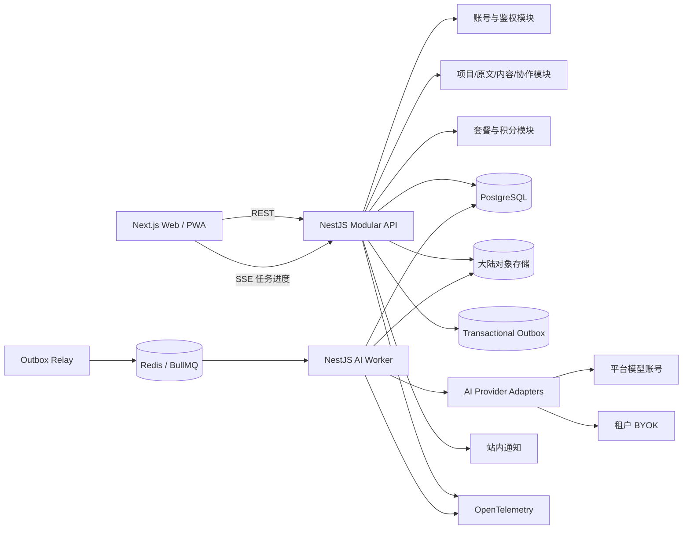

# 系统架构设计：AI 小说动态漫改编工作台

状态：T03 评审稿  
日期：2026-09-22

## 1. 架构目标

用尽可能低的运维复杂度交付一条可靠纵向闭环：登录 → 项目 → 章节导入 → 故事知识 → 剧本 → 设定 → 分镜 → 导出。同时确保内容版本、追溯、阶段门禁、AI 部分成功、积分结算和中国大陆数据约束从第一版就存在。

## 2. 架构原则

1. 模块化单体优先，拒绝为未知规模提前拆微服务。
2. HTTP 请求与 AI 长任务分离部署，领域契约保持统一。
3. PostgreSQL 是权威状态源；队列不是业务事实源。
4. 原文和内容版本不可变，所有正式变化产生新版本。
5. AI 提供商位于适配器之后，不进入 canonical domain model。
6. 工作模式、UI 游标和内容版本相互独立。
7. 数据、权限、积分与 AI 回调均按租户隔离并可审计。
8. 未经 T01b 验证的术语和布局保持可配置、可替换。

## 3. 推荐技术栈

| 层 | 推荐 | 理由 |
| --- | --- | --- |
| Monorepo | pnpm workspace + Turborepo | 共享 TypeScript 契约、构建缓存、适合小团队 |
| Web/PWA | Next.js + React + TypeScript | 桌面工作台与移动审核共用响应式 Web；MVP 不开发原生 App |
| API | NestJS + TypeScript | 模块边界、校验、鉴权、OpenAPI 和后台服务结构明确 |
| Worker | 独立 NestJS Worker 进程 | 与 API 分开扩缩容，但共享领域模块和 AI 适配器 |
| 数据库 | PostgreSQL | 强事务、关系完整性、JSONB、审计与版本查询 |
| ORM/迁移 | Drizzle ORM | 显式 SQL、类型安全、迁移透明；领域规则不放进 ORM 模型 |
| 队列 | Redis + BullMQ | MVP 运维简单，支持延迟、重试和独立 Worker；权威任务状态仍在 PostgreSQL |
| 对象存储 | 中国大陆区域 OSS/COS，通过 StoragePort 接入 | 保存原文件、导出物和临时制品，避免数据库存大文件 |
| 实时进度 | SSE | 单向任务进度足够，复杂度低于 WebSocket |
| Schema | JSON Schema Draft 2020-12 + Ajv | 已有契约可直接复用，供应商输出先做结构验证 |
| 文档导出 | docx + ExcelJS | Node 生态内完成 DOCX/XLSX；JSON 直接按版本化 Schema 输出 |
| 观测 | OpenTelemetry + 结构化日志 + 云监控 | 供应商中立，关联 request/job/tenant，禁止记录原文正文和密钥 |
| 部署 | 中国大陆单区域托管容器 + 托管 PostgreSQL/Redis/对象存储 | 满足内测规模，避免 Kubernetes 和跨区域复杂度 |

## 4. 高层架构



## 5. 模块边界

| 模块 | 职责 | 禁止承担 |
| --- | --- | --- |
| Identity | 手机/微信身份、账号绑定、会话 | 项目权限规则 |
| Workspace | 工作室、成员、角色、邀请 | 内容编辑逻辑 |
| Project | 项目配置、章节目录、比例、叙事模式 | AI 供应商参数 |
| Source | 文件导入、章节识别、原文版本、片段 ID、差异 | 改编内容生成 |
| Adaptation | 故事知识、剧本、设定、分镜、阶段门禁 | 队列细节、积分扣费 |
| Provenance | 来源、转换方式、改编新增、跨对象映射 | UI 高亮状态 |
| Versioning | 候选/确认/锁定、影响分析、版本派生 | 原文正文存储之外的文件管理 |
| Collaboration | 修改建议、处理结果、审核人 | 实时协同编辑 |
| AI Orchestration | 任务、scope、幂等、校验、部分成功、重试 | 直接修改已确认内容 |
| Provider Gateway | 模型路由、参数映射、凭据、成本 | 领域状态决策 |
| Billing | 套餐、额度、冻结、结算、退款流水 | 直接调用模型 |
| Export | DOCX/XLSX/JSON 生成与制品记录 | 改写内容 |
| Compliance | 权利声明、扫描、投诉、申诉、限制状态 | 静默删除项目 |
| Audit | 追加式关键操作记录 | 存原文全文或密钥 |
| Notification | 站内通知、已读状态 | 作为任务状态源 |

## 6. 核心数据流

### 6.1 导入章节

```text
请求上传凭证 → 对象存储直传 → 完成回调
→ 文件校验/合规扫描 → 章节识别
→ 用户选择章节 → 建立 SourceVersion 与 SourceFragment
→ 保存内容哈希 → 写审计记录
```

上传完成回调必须验证租户、对象 key、大小、MIME、哈希和一次性令牌。DOCX/TXT 解析在受限 Worker 中执行，禁止宏和外部引用。

### 6.2 启动 AI 阶段

```text
校验权限/上游确认/锁定/积分
→ PostgreSQL 事务内创建 AIJob、冻结积分、写 Outbox
→ Relay 发布队列
→ Worker 读取 canonical 输入快照
→ Provider Adapter 调用模型
→ JSON Schema + 领域不变量校验
→ 条目级保存成功/失败
→ 结算成功成本、退回失败冻结
→ 通知用户
```

`jobId + scopeKey + attempt` 唯一；供应商回调或 Worker 重试只能推进状态，不得重复结算。

### 6.3 确认与版本派生

```text
读取当前候选版本 → 乐观锁校验 revision
→ 校验全部阻断项和证据
→ 生成确认事件与确认人/时间
→ 更新 StageResult.confirmedVersionId
→ 解锁下一阶段生成权限
→ 审计
```

修改已确认内容不原地编辑，而是从确认版本派生新候选版本并计算受影响项。

### 6.4 三种工作模式

- API 返回同一 canonical content 和明确的投影视图数据。
- 用户偏好表保存默认工作模式；短期工作游标存浏览器会话，跨设备需要时再同步到独立 `work_cursor` 表。
- URL 可以保存 `mode/chapter/episode/scene/shot/source` 定位，但不得参与内容版本哈希。
- 模式切换不得触发写业务内容、创建版本或启动 AI 任务。

## 7. 数据存储策略

### 7.1 PostgreSQL

保存租户、账号、成员、项目、章节元数据、原文版本/片段、内容版本、条目、映射、确认、锁定、建议、任务、积分、通知和审计索引。

关键约束：

- 所有租户业务表包含 `workspace_id`，仓储查询必须显式带租户范围。
- 内容版本只追加，不允许更新已确认正文。
- 金额与积分使用整数最小单位。
- 积分余额来自流水汇总；冻结、结算、退款使用唯一业务键。
- 大正文可先保存在 PostgreSQL `text/jsonb`；单章 20,000 字无需提前引入文档数据库。

### 7.2 对象存储

- 原始 TXT/DOCX、导出 DOCX/XLSX/JSON 和可能的临时解析制品。
- key 包含环境与租户不可猜测前缀，不暴露用户文件名。
- 私有桶、短期签名 URL、服务端加密、生命周期清理。
- 业务数据库保存对象 ID、哈希、大小、类型和删除状态。

### 7.3 Redis

- BullMQ 队列、短期幂等锁、频率限制和可丢失缓存。
- 不保存唯一业务事实；Redis 丢失时可从 PostgreSQL 未完成任务重建队列。
- MVP 不引入 Elasticsearch、向量数据库或图数据库；先使用 PostgreSQL 检索和关系表。

## 8. 安全与合规

- 全链路 TLS；数据库、对象存储和备份启用静态加密。
- BYOK 使用云 KMS 信封加密：数据库只保存密文、key version 和提供商元数据。
- 解密仅发生在 Worker 调用窗口；密钥不进入 API 响应、日志、追踪和错误信息。
- 手机验证码带频率限制、设备/IP 风险控制和短期有效期。
- 微信登录通过服务端 OAuth 回调绑定账号；避免客户端直接信任 openid。
- 对象级授权在 API/服务层执行，禁止仅依赖前端隐藏按钮。
- 审计日志追加写，保存 actor、action、target、version、requestId、reason，不记录完整原文。
- 数据离境模型调用前检查租户授权与任务级提示；未授权则路由大陆模型或拒绝任务。
- 删除采用状态机：活动 → 30 天回收站 → 业务数据/文件删除 → 备份自然过期（最长 90 天）。

## 9. 非功能目标

| 类别 | MVP 目标 |
| --- | --- |
| 同步 API | 读取 p95 < 500ms；普通写入 p95 < 1s，不含上传与 AI |
| 页面 | 主要工作台可交互时间目标 < 3s（正常大陆网络） |
| AI 阶段 | 单章 ≤20,000 字时通常 5 分钟内；超时不自动等同失败 |
| 可用性 | 内测目标 99.5%，不承诺多区域容灾 |
| RPO | PostgreSQL ≤1 小时；对象存储依赖版本/备份策略 |
| RTO | 4 小时内恢复内测服务 |
| 扩展 | API 与 Worker 独立水平扩展；按供应商和租户限制并发 |
| 可观测 | requestId、jobId、workspaceId、providerRequestId 全链路关联 |
| 隐私 | 日志、指标、追踪不包含原文正文、BYOK、验证码和授权材料内容 |

## 10. 失败模式与恢复

| 失败 | 表现 | 恢复策略 |
| --- | --- | --- |
| 数据库不可用 | API 写入与任务落库失败 | 快速失败；不发布队列；托管备份与故障切换 |
| Redis/队列不可用 | 新任务延迟 | Outbox 保留；恢复后重放，任务状态仍在 PG |
| Worker 崩溃 | 任务停在运行中 | lease 超时回收；幂等重试 |
| 模型超时/限流 | 部分或全部失败 | 指数退避、供应商切换策略、保留成功项 |
| 返回非法 JSON | 无法持久化正式结果 | 保存脱敏错误元数据；结构化修复重试或标失败 |
| 对象存储失败 | 上传/导出不可用 | DB 不提交完成状态；制品可重建 |
| 积分结算中断 | 冻结未结算 | 幂等 reconciliation job 对账修复 |
| 通知失败 | 用户未及时看到结果 | 任务状态不受影响；通知可重建和重试 |
| BYOK 无效 | 对应调用失败 | 不消耗平台模型积分；提示重新验证密钥 |

## 11. 部署拓扑与成本边界

### 11.1 封闭内测

- 单个中国大陆区域。
- Web/API 两个容器副本或一个可滚动更新的托管应用。
- Worker 初始 1～2 个实例，按队列长度扩展。
- 托管 PostgreSQL 单主实例，启用自动备份。
- 小规格托管 Redis。
- 私有对象存储与 CDN（仅公开静态资源使用 CDN）。
- 非生产环境共享小规格资源，但数据和密钥完全隔离。

### 11.2 月度预算护栏（不含 AI 模型调用）

封闭内测基础设施设置人民币 **1,000～3,500 元/月** 的预算护栏；超过上限必须由实际并发、存储或可用性数据解释。模型成本按任务独立记录，不混入固定基础设施成本。供应商正式选型时以中国大陆区域实时报价复核。

## 12. 暂缓决定

- 云厂商最终选择：阿里云、腾讯云或火山引擎在部署前按资质、价格、模型可用区和团队经验决策。
- 模型路由策略：先有 ProviderPort 和手动配置，再根据质量/成本数据自动路由。
- 向量检索：单章 20,000 字和逐章流程下暂不需要；整书跨章检索出现证据后再引入。
- 原生移动端：PWA 内测验证不足时再评估。
- 微服务/Kubernetes：团队和负载达到明确阈值后再拆分。

